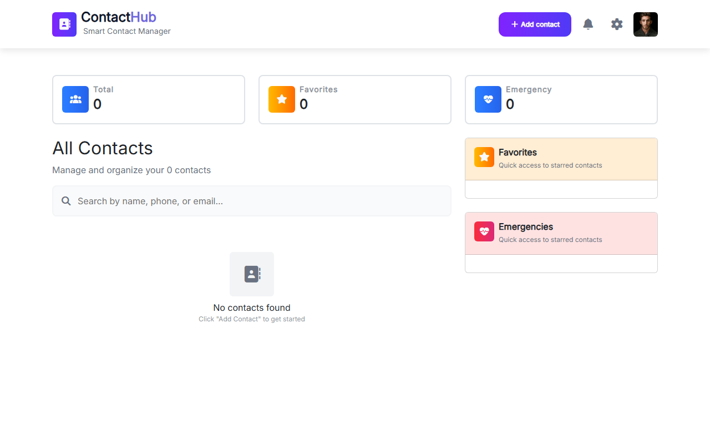

# ContactHubPro
**A responsive, browser-based contact management application built with vanilla JavaScript, Bootstrap, and LocalStorage.**

**[Live Demo](https://shalabycode.dev/contuctHubApp/)** · **[Source](https://github.com/Shalabyelectronics/contuctHubApp)**



## About
ContactHubPro is a client-side address book and contact management tool running entirely in the browser. It helps users organize, search, and manage personal and professional contacts with zero backend setup. Built as a front-end portfolio project, it demonstrates modular vanilla JavaScript architecture, live form validation, dynamic DOM updates, and browser state persistence.

## Features
- **Full CRUD operations**: Create, read, edit existing contact details, and delete entries via a confirmation modal.
- **Form validation**: Validates names, phone numbers, and emails in real time with Regular Expressions and error modals.
- **Duplicate detection**: Checks phone numbers against existing entries to prevent duplicate contact records.
- **Categorization and groups**: Tag contacts under Family, Friends, Work, School, or Other with distinct visual badges.
- **Favorites and emergency lists**: Star contacts or mark them as emergency contacts with dedicated sidebar quick-access lists.
- **Real-time search**: Filter contacts instantly across name, phone number, and email fields with an empty-state fallback.
- **Direct contact actions**: One-click phone calling via `tel:` links and email drafting via `mailto:` links.
- **LocalStorage persistence**: Automatically saves all contacts and keeps dashboard counters (Total, Favorites, Emergencies) in sync.

## Built With
- Vanilla JavaScript (ES6+)
- Bootstrap 5 (CSS & Modal Bundle)
- HTML5 & CSS3 (CSS Custom Properties)
- Font Awesome Icons
- Web Storage API (`localStorage`)

## What I Learned
- Structuring reusable HTML component templates in JavaScript using template literals and dynamic DOM insertion (`replaceChild`, `insertAdjacentHTML`).
- Implementing client-side regex input validation with immediate visual feedback states and conditional modal triggers.
- Synchronizing multi-list application state (all contacts, favorites, emergency subsets) with browser `localStorage`.
- Managing event listeners and performing DOM queries across dynamically rendered action buttons.

## Getting Started
Clone the repository and launch the project directly:

```bash
git clone https://github.com/Shalabyelectronics/contuctHubApp.git
cd contuctHubApp
```

Open `index.html` in any modern web browser or serve it using the VS Code Live Server extension.

## Project Structure
```text
contuctHubApp/
├── css/
│   ├── bootstrap.min.css
│   └── style.css
├── js/
│   ├── bootstrap.bundle.min.js
│   ├── contactCardComponent.js
│   └── index.js
└── index.html
```

## Roadmap
- [ ] Support international phone number formats beyond standard regional prefixes.
- [ ] Add custom image uploads via file input or base64 storage.
- [ ] Implement data export and import functionality (JSON / CSV).

## Author
Mohamed Shalaby
- Website: [shalabycode.dev](https://shalabycode.dev)
- GitHub: [@Shalabyelectronics](https://github.com/Shalabyelectronics)
- LinkedIn: [Mohamed Shalaby](https://www.linkedin.com/in/mhdshalaby/)
